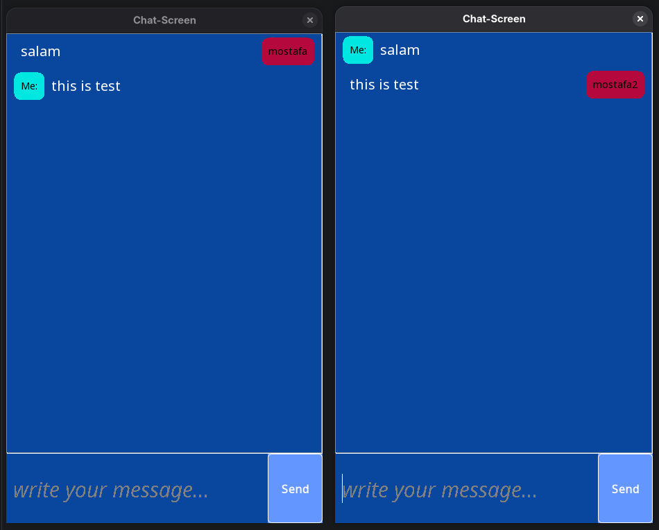

# Chat Program

A simple desktop chat application built with Java that allows multiple users to communicate through a client-server connection.

The project includes a Swing-based graphical interface, TCP socket communication, and SQLite-based user registration and login.

## Demo



## Features

* User registration and login
* Desktop graphical interface built with Java Swing
* Real-time communication between multiple clients
* TCP socket-based client-server communication
* Local user storage using SQLite
* Custom Swing UI components

## Technologies

* Java 21
* Java Swing
* Java Sockets
* SQLite
* JDBC
* Maven

## Project Structure

```text
src/main/java/com/mostafanasrollahpour/chat/
├── client/
│   ├── Client.java
│   ├── ClientMain.java
│   └── ui/
│       ├── ChatScreen.java
│       ├── Index.java
│       ├── Login.java
│       ├── Register.java
│       └── components/
├── database/
│   └── Database.java
└── server/
    ├── ClientHandler.java
    ├── Server.java
    └── ServerMain.java
```

### Packages

* `client` — Handles the client connection and application entry point.
* `client.ui` — Contains the Swing user interface.
* `client.ui.components` — Contains reusable custom Swing components.
* `server` — Handles incoming client connections and message broadcasting.
* `database` — Handles local SQLite user storage and authentication data.

## How It Works

The application consists of a server and one or more clients.

Chat messages are exchanged between clients through the server using TCP sockets:

```text
Client ──┐
Client ──┼── TCP Socket ──> Server
Client ──┘
```

User registration and login data are stored locally using SQLite:

```text
Client UI ──> Login / Registration ──> SQLite Database
```

The server listens for client connections on port `5693`. Messages sent by a connected client are forwarded to the other connected clients.

The SQLite database is created locally as `sample.db` when needed.

## Getting Started

### Requirements

* JDK 21
* Maven

An IDE with Java support, such as IntelliJ IDEA, is recommended for running the server and client entry points.

### Build

Clone the repository and compile the project:

```bash
mvn clean compile
```

### Run the Application

Start the server first by running the following main class from your IDE:

```text
com.mostafanasrollahpour.chat.server.ServerMain
```

Then start one or more clients by running:

```text
com.mostafanasrollahpour.chat.client.ClientMain
```

Multiple client instances can be opened to test the chat locally.

## Project History

This project was originally developed between **January 25 and February 1, 2025** as a learning project focused on Java desktop development, socket programming, and SQLite.

In **September 2026**, the repository was revisited to improve its directory structure, naming conventions, and documentation while preserving the original scope of the project.

The original Git commit history has been preserved to reflect the actual development timeline.

## Notes

* The application is designed to run locally using `localhost`.
* The server listens on port `5693`.
* User data is stored locally in an SQLite database.
* The project was originally created as a learning project and is not intended to represent a production-ready chat system.

## License

This project is licensed under the [MIT License](LICENSE).
